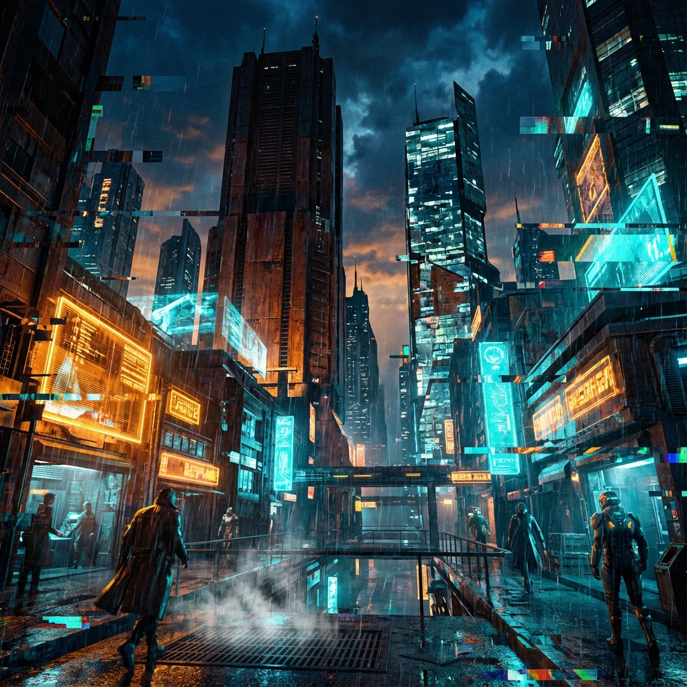
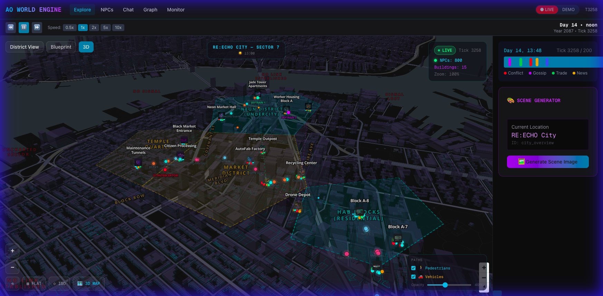
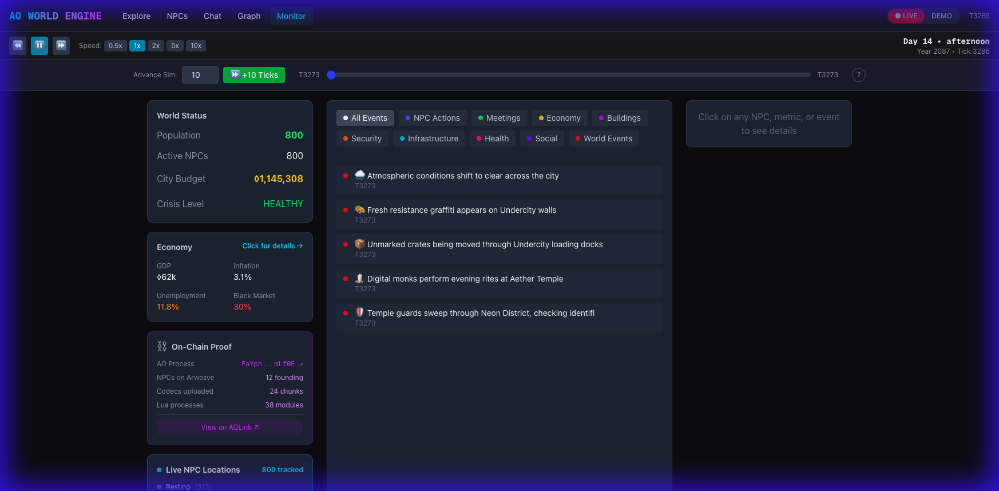
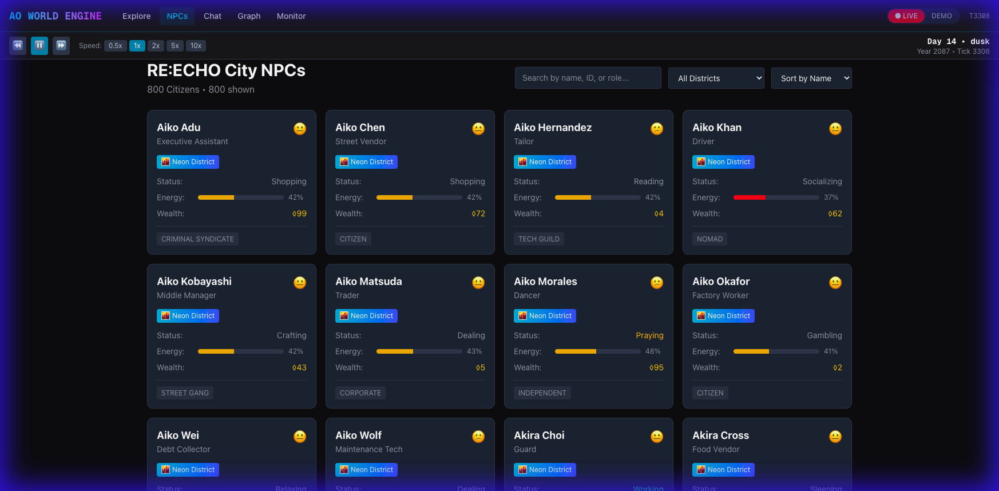

# 🌐 AO World Engine

> A decentralized simulation engine for persistent worlds on Arweave + AO

[](https://www.gnu.org/licenses/agpl-3.0)
[](https://ao.arweave.dev)
[](https://arweave.org)

<p align="center">
  
</p>

*Build persistent, decentralized worlds. Every world has its own aesthetic.*

## 📸 Screenshots

| 3D City Explorer | World Monitor |
|:----------------:|:-------------:|
|  |  |
| Live 3D map with districts, NPCs & vehicles | Economy, events & simulation metrics |

| NPC Registry |
|:------------:|
|  |
| 823 NPCs with personality, faction & location |

## 🚀 Get Started

| Option | Description | Link |
|--------|-------------|------|
| 🎮 **Explore the City** | Live 3D map with 823 NPCs, vehicles & districts | [**Launch Studio →**](https://ao-world-engine-studio-1071951656531.us-central1.run.app/explore) |
| 🛠️ **Build Your Own** | Fork the repo and create your world | [**GitHub Repo →**](https://github.com/WandernGeo/ao-world-engine) |
| 🎨 **Frontend Only** | Just want the visualizer? | [**Frontend Docs →**](docs/FRONTEND_GUIDE.md) |
| ☁️ **Cloud Deployment** | Deploy on Cloud Run or your infra | [**Deploy Guide →**](docs/DEPLOYMENT.md) |
| 🤝 **Have Us Build It** | Custom world development services | [**Contact Us →**](mailto:contact@geoechoes.com) |

---

## 🎮 What Can You Test?

| Feature | Description |
|---------|-------------|
| 🧠 **NPC Memory** | NPCs remember past conversations |
| 🔗 **Relationships** | Ask about other characters - NPCs know who they trust |
| ⏰ **Tick Time** | Change the tick to see different days/weather/moods |
| 🎭 **Consistency** | Same questions, same tick = consistent answers |
| 🎲 **Risk System** | NPCs take risks based on personality (heists, gambling, ventures) |
| 🌍 **Physics** | Gravity, inertia, projectiles, collisions |

> **What's a Tick?** A tick is one unit of simulation time. Day = tick ÷ 24, Hour = tick % 24. At tick 100, it's Day 5 at 4:00 AM.

---

## What Is This?

AO World Engine is an **open source simulation framework** for building persistent, decentralized worlds on [Arweave](https://arweave.org) and [AO](https://ao.arweave.dev).

**Use it to build:**
- 🏙️ Simulated cities with millions of NPCs
- 🎮 Persistent MMO game backends
- 🤖 Autonomous agent ecosystems
- 📖 Living narrative worlds
- 🌍 Any world that runs forever on the permaweb

```
YOUR WORLD (copyrighted)          THE ENGINE (open source)
        │                                   │
        │ "Neo Tokyo"                       │
        │ "Martian Colony"                  │
        │ "Fantasy Kingdom"       ◀─────────┤
        │ "Your World Here"                 │
        │                                   │
        │                                   │
        ▼                                   ▼
┌─────────────────────┐         ┌─────────────────────┐
│ Your lore           │         │ NPC state machines  │
│ Your art style      │   uses  │ Deterministic sched │
│ Your characters     │◀────────│ Faction system      │
│ Your animations     │         │ City services       │
│                     │         │ Event broadcasting  │
│ © You, All Rights   │         │ Canon validation    │
│    Reserved         │         │                     │
│                     │         │ AGPL-3.0 Open Source│
└─────────────────────┘         └─────────────────────┘
```

---

## Key Features

### 🔄 Deterministic Pseudo-Random Scheduling
NPCs know where each other will be **without messaging**. Given NPC ID + time, any process can calculate location.

### 📦 <100KB Chunking
Designed for Arweave's free upload tier. All data chunks to under 100KB.

### 🛡️ Canon Validation
Built-in content moderation. Invalid submissions are transformed or rejected automatically.

### 🌍 Runs Forever
Once deployed, the world simulates autonomously on AO cron jobs. No servers needed.

### 🔌 Bring Your Own Lore
The engine is lore-agnostic. Plug in your own world, factions, and art style.

### 🌀 Echo Layers (Multiverse System)
**NEW**: Worlds can fork into parallel dimensions (layers). NPCs experience rare "bleed" events where they glimpse alternate realities. Users "Watch" like higher beings observing the simulation.

- **Layer 0 (Prime)**: Your official canon world
- **Layer 1+**: Community-created alternate timelines
- **The Veil**: Thin barriers between layers (0.1% bleed chance per tick)
- **The Watchers**: Users observing via visualization apps

See [ECHO_LAYERS.md](./docs/ECHO_LAYERS.md) for the full multiverse system (create your own lore!).

### 🧠 AI Oracle (LLM-Powered NPCs)

NPCs don't store full dialogue - they store **personality vectors** and **topic weights**. When observed, the AI Oracle generates contextual dialogue.

**Bring Your Own LLM** - works with any provider:

| Provider | Config |
|----------|--------|
| Google Vertex AI | `gcloud auth` (recommended) |
| OpenAI | `OPENAI_API_KEY` |
| Anthropic Claude | `ANTHROPIC_API_KEY` |
| Local (Ollama) | `OLLAMA_URL` |

```lua
-- Configure in AOS:
Send({ Target = AI_ORACLE, Action = "set-llm-endpoint", Data = "your-bridge-url" })
```

NPCs generate their own dialogue based on:
- `personality_vector` (paranoia: 0.8, mysticism: 0.9)
- `topic_weights` (philosophy: 0.9, trade: 0.2)
- `speech_patterns` (vocabulary: "poetic", short: true)

See [npc_semantic_profile.json](./schemas/npc_semantic_profile.json) for the full schema.

---

## Quick Start

```bash
# Clone the engine
git clone https://github.com/WandernGeo/ao-world-engine.git
cd ao-world-engine

# Install AOS CLI
npm install -g aos

# Start AO shell
aos

# Load a district process
.load ao-processes/district.lua

# Initialize with NPCs
Send({ Target = ao.id, Action = "init", Data = '{"npc_count": 100}' })
```

---

## Project Structure

```
ao-world-engine/
├── ao-processes/           # AO Lua processes
│   ├── district.lua        # District simulation
│   ├── global_event_bus.lua # World-level events
│   └── canon_validator.lua # Content validation
├── viewer/                 # Open source viewer (HTML/CSS/JS)
│   ├── index.html          # Basic world state viewer
│   ├── style.css           # Minimal styling
│   └── app.js              # AO query client
├── demo/                   # Python demo server + API tester
├── schemas/                # JSON schemas
│   ├── action_dictionary.json
│   ├── factions.json
│   └── city_services.json
├── docs/
│   ├── CANON_GOVERNANCE.md # Content rules
│   └── BUILDING_YOUR_WORLD.md
└── examples/               # Example implementations
    └── generic_city/       # Starter template
```

> **Note**: Premium visualization tools (StudioRam) are available separately for commercial projects.

---

## Building Your World

1. **Fork this repo**
2. **Define your lore** - Create your factions, districts, NPCs
3. **Customize schemas** - Adapt archetypes to your setting
4. **Deploy to AO** - Your world runs on the permaweb
5. **Build visualization** - Connect your own rendering layer

See [BUILDING_YOUR_WORLD.md](./docs/BUILDING_YOUR_WORLD.md) for detailed guide.

---

## Worlds Built on This Engine

| World | Creator | Description |
|-------|---------|-------------|
| *Your world here* | You | Fork and build! |

*Want to be listed? Open a PR!*

---

## License

**AGPL-3.0** - You can use this commercially, but modifications must stay open source.

This protects the community while allowing you to build proprietary worlds **on top of** the engine.

---

## 📚 Documentation

| Doc | What It Covers |
|-----|----------------|
| [GETTING_STARTED.md](./docs/GETTING_STARTED.md) | **Start here!** Local install, hosted API, full guide |
| [CHANGELOG.md](./CHANGELOG.md) | Recent changes and version history |
| [LOCAL_SETUP.md](./docs/LOCAL_SETUP.md) | Run locally with local data |
| [GRAPH_VISUALIZATION.md](./docs/GRAPH_VISUALIZATION.md) | Graph network view explained |
| [API_DOCUMENTATION.md](./docs/API_DOCUMENTATION.md) | Full API reference |
| [SIMULATION_SYSTEM.md](./docs/SIMULATION_SYSTEM.md) | NPC schedules, moods, hobbies |
| [AI_NPC_SYSTEM.md](./docs/AI_NPC_SYSTEM.md) | LLM chat integration |
| [BUILDING_YOUR_WORLD.md](./docs/BUILDING_YOUR_WORLD.md) | Create your own world |
| [ARWEAVE_TRANSACTION_LOG.md](./docs/ARWEAVE_TRANSACTION_LOG.md) | Arweave upload history |

---

## Links

- [AO Cookbook](https://cookbook.ao.arweave.dev/)
- [Arweave Docs](https://docs.arweave.org/)
- [ArDrive](https://ardrive.io/)

---

*"The engine runs forever. What you build on it is yours."*
