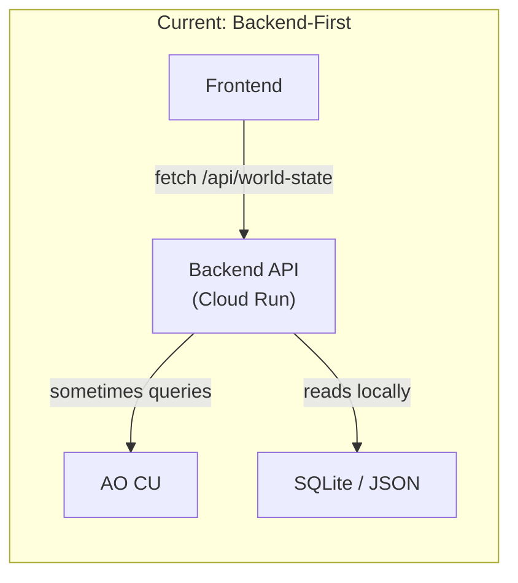
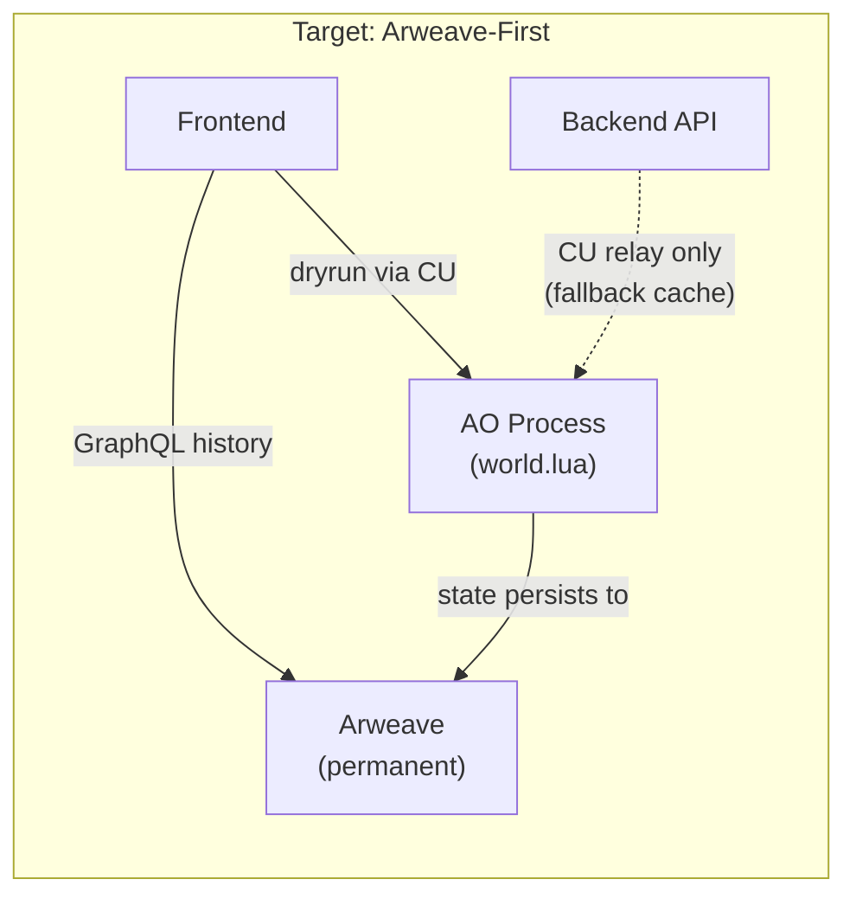
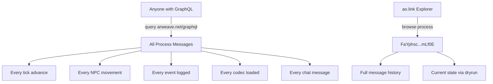

# Arweave-First Architecture: AO as Compute, Arweave as Truth

> Making the simulation a **legitimate decentralized system** — data lives on Arweave, compute runs on AO, the frontend is just a viewer.

---

## Current State vs. Target State





---

## What Already Exists (You're Closer Than You Think)

| Component | File | Status | What It Does |
|-----------|------|--------|-------------|
| **AO World Process** | `world.lua` (2,479 lines) | ✅ Deployed | Tick advance, NPC management, economy, social, chat memory |
| **Codec Loader** | `codec_loader.lua` | ✅ Deployed | Hot-loads world codec JSON from Arweave on-chain |
| **Event Sourcing** | `event_sourcing.lua` | ✅ Deployed | Full `EVENT_LOG[]` with query-by-type/actor/tick + Arweave bundle export |
| **Event Bus** | `global_event_bus.lua` | ✅ Deployed | Broadcasts events to district processes |
| **AO Client** | `ao-client.ts` | ✅ Working | CU failover (3 endpoints), rate limiting, stale detection |
| **Arweave GraphQL** | `ao-client.ts` L710-841 | ✅ Working | Full history query, action summaries |
| **NPC Locations (AO)** | `ao-client.ts` L388-413 | ✅ Working | `get-npc-locations` via dryrun |
| **Backend API** | `api_simulation.py` | ✅ Deployed | Currently **primary** source, needs to become **fallback** |

> [!IMPORTANT]
> **The AO process already IS the source of truth for tick, NPCs, economy, and events.** The backend just caches and relays. The shift is about making the frontend read AO directly, with the backend as a performance cache.

---

## The Three Layers

### Layer 1: Arweave = Permanent Data (The Codecs)

Everything that defines the *world rules* lives on Arweave permanently:

| Codec | Arweave TxID | What It Contains |
|-------|-------------|-----------------|
| `world_codec_01_npcs` | *(uploaded)* | NPC names, archetypes, personalities, home/workplace |
| `world_codec_07_events` | *(uploaded)* | Event templates, generation algorithm |
| `world_codec_13_canon_events` | *(uploaded)* | Story events with Arweave tags |
| `world_codec_14_behaviors` | *(uploaded)* | Schedules, shifts, activity patterns |
| `world_codec_16_buildings` | *(uploaded)* | Building registry, types, districts |
| `world_codec_34_schedules` | *(uploaded)* | Enhanced daily schedules |
| ... 35 chunks total | | |

**How they load into AO:**
```
Arweave TX → LoadCodec message → codec_loader.lua → world.lua uses data
```

Anyone can verify: query `arweave.net/graphql` for `App-Name: AO-World-Engine` transactions.

### Layer 2: AO Process = Live Compute (The Simulation)

The AO process (`world.lua`) runs the simulation on each CRON tick:

```lua
-- Already in world.lua:
WorldTick = WorldTick or 0      -- Persisted on Arweave
WorldDay = WorldDay or 0
WorldYear = WorldYear or 0
NPCSocialHistory = {}           -- Relationship tracking
ChatMemory = {}                 -- Conversation memory
PendingEvents = {}              -- Event queue
```

**AO Handlers the frontend can query (already exist):**

| Handler | Action Tag | Returns |
|---------|-----------|---------|
| `get-state` | `Action: "get-state"` | Tick, day, year, population, budget |
| `get-time` | `Action: "get-time"` | Hour, period, tick |
| `get-economy` | `Action: "get-economy"` | Budget, tax rate, revenue |
| `get-npc-locations` | `Action: "get-npc-locations"` | All NPC positions |
| `GetRecentEvents` | `Action: "GetRecentEvents"` | Last N events from `EVENT_LOG` |
| `GetActorEvents` | `Action: "GetActorEvents"` | Events by NPC ID |
| `GetArweaveBundle` | `Action: "GetArweaveBundle"` | Export for permanent storage |
| `ListCodecs` | `Action: "ListCodecs"` | Which codecs are loaded |

### Layer 3: Frontend = Pure Viewer

The frontend reads state from AO, never generates it:

```typescript
// ao-client.ts already has this fallback chain:
// 1. AO CU dryrun (primary — decentralized)
// 2. Backend API (cache relay)  
// 3. localStorage (offline fallback)
```

---

## What Needs to Change

### 1. Flip the Priority in `getWorldState()`

Currently the backend API is called **first**. Flip it:

```diff
// ao-client.ts getWorldState()
- // Primary: Backend API
- const res = await fetch(`${BACKEND_API}/api/world-state`);
+ // Primary: AO CU dryrun (decentralized)
+ const result = await withTimeout((dryrun) => dryrun({
+     process: AO_PROCESS_IDS.world,
+     tags: [{ name: "Action", value: "get-state" }],
+     data: "{}",
+ }));
+ // Fallback: Backend API (cache)
+ const res = await fetch(`${BACKEND_API}/api/world-state`);
```

### 2. Move NPC Event Generation to AO

Currently the frontend `simulationEngine.ts` generates events locally. Instead, query AO:

```typescript
// New function in ao-client.ts:
export async function getWorldEvents(tick: number, limit = 20) {
    const result = await withTimeout((dryrun) => dryrun({
        process: AO_PROCESS_IDS.world,
        tags: [
            { name: "Action", value: "GetRecentEvents" },
            { name: "Count", value: String(limit) },
        ],
        data: "{}",
    }));
    return JSON.parse(result.Messages?.[0]?.Data || "[]");
}
```

### 3. Push Scene-Generated Events Back to AO

When the deterministic engine or a scene generation creates a notable event, write it back:

```typescript
// After scene generation or major event:
import { message } from "@permaweb/aoconnect";

await message({
    process: AO_PROCESS_IDS.world,
    tags: [
        { name: "Action", value: "LogEvent" },
    ],
    data: JSON.stringify({
        event_type: "scene_generated",
        payload: {
            tick, npcId, buildingId, activity,
            imageUrl, // Arweave TX of the generated image
        },
        actor_id: npcId,
    }),
});
```

### 4. Arweave-Tag Major Events for Permanent Search

The `event_sourcing.lua` already has `create_arweave_bundle()`. Wire it to periodically archive:

```lua
-- In world.lua CRON handler, every 100 ticks:
if WorldTick % 100 == 0 then
    local bundle = create_arweave_bundle(false)
    -- Bundle is automatically Arweave-persistent via AO message log
end
```

---

## Data Provenance: How Anyone Can Verify

The entire system is transparent and verifiable:



**Verification steps anyone can take:**

1. **View the process:** `https://ao.link/#/entity/FaYphsc8GASaJEBhg4X3ZZV7jQ5hGci9klFY90mLf0E`
2. **Query state:** Send a dryrun with `Action: "get-state"` to get current tick
3. **See all history:** GraphQL query for all transactions to this process
4. **Load the codecs:** Every codec chunk has an Arweave TX ID — download and verify
5. **Replay events:** `GetArweaveBundle` returns full event history

---

## Architecture Summary

| Data | Where It Lives | Who Can Read | Mutable? |
|------|---------------|-------------|----------|
| World codec (NPC defs, buildings, rules) | Arweave | Anyone | ❌ Immutable |
| Canon events (story) | Arweave (tagged) | Anyone via GraphQL | ❌ Immutable |
| Live simulation state (tick, positions) | AO Process memory | Anyone via CU dryrun | ✅ Advances each tick |
| Event log (recent) | AO `EVENT_LOG[]` | Anyone via `GetRecentEvents` | ✅ Rolling window |
| Event archive (all time) | Arweave bundles | Anyone via GraphQL | ❌ Immutable |
| Scene images | Arweave (tagged) | Anyone via GraphQL | ❌ Immutable |
| Chat memory | AO Process memory | Anyone via `Chat` handler | ✅ Grows over time |

> [!TIP]
> **The backend API becomes a convenience layer** — a CDN for CU queries. It caches AO responses for 30s so the frontend doesn't DDoS the CU. But everything it serves is verifiable by querying AO directly. Remove the backend and the system still runs.
