# CS2 → AO World Engine: Gap Analysis & Implementation Roadmap

> Cross-reference of Cities: Skylines II features against our existing codec/simulation.
> ✅ = Fully covered | 🟡 = Partially covered | ❌ = Missing | 🔵 = RE:ECHO unique (no CS2 equivalent)

---

## Self-Checking Diagram

```mermaid
graph TD
    subgraph "CS2 SYSTEMS vs AO WORLD ENGINE"
        direction TB
        
        subgraph ECONOMY["💰 ECONOMY"]
            E1["Taxation (granular)"]
            E2["Service Fees"]
            E3["Loans"]
            E4["Production Chains"]
            E5["Supply/Demand"]
            E6["Outside Trade"]
            E7["Company Efficiency"]
            E8["City Budget"]
        end
        
        subgraph CITIZENS["👤 CITIZENS"]
            C1["Life Stages"]
            C2["Education Tiers"]
            C3["Wealth Levels"]
            C4["Happiness/Well-being"]
            C5["Lifepath"]
            C6["Conditions"]
            C7["Leisure System"]
            C8["Social Safety Net"]
        end
        
        subgraph INFRA["🏗 INFRASTRUCTURE"]
            I1["Power Grid"]
            I2["Water & Sewage"]
            I3["Roads & Maintenance"]
            I4["Public Transit"]
            I5["Parking"]
            I6["Communications"]
        end
        
        subgraph SERVICES["🏥 SERVICES"]
            S1["Healthcare"]
            S2["Education"]
            S3["Police/Crime"]
            S4["Fire & Rescue"]
            S5["Garbage"]
            S6["Administration"]
        end
        
        subgraph ENV["🌍 ENVIRONMENT"]
            V1["Pollution (4 types)"]
            V2["Natural Resources"]
            V3["Climate & Weather"]
            V4["Disasters"]
            V5["Land Value"]
        end
        
        subgraph ZONES["🏘 ZONING"]
            Z1["Residential Densities"]
            Z2["Commercial"]
            Z3["Industrial"]
            Z4["Office"]
            Z5["Building Levels"]
            Z6["Districts & Policies"]
        end
        
        subgraph TRANSPORT["🚌 TRANSPORT"]
            T1["Bus"]
            T2["Subway/Metro"]
            T3["Train"]
            T4["Tram"]
            T5["Ferry/Ship"]
            T6["Taxi"]
            T7["Cargo Network"]
        end
        
        subgraph PROGRESSION["📈 PROGRESSION"]
            P1["Milestones & XP"]
            P2["Development Tree"]
            P3["Map Expansion"]
            P4["Tourism"]
        end
    end

    style E1 fill:#FFA500
    style E2 fill:#FFA500
    style E3 fill:#FF4444
    style E4 fill:#FFA500
    style E5 fill:#FFA500
    style E6 fill:#FFA500
    style E7 fill:#FF4444
    style E8 fill:#00AA00
    
    style C1 fill:#FFA500
    style C2 fill:#FFA500
    style C3 fill:#00AA00
    style C4 fill:#FFA500
    style C5 fill:#FFA500
    style C6 fill:#FF4444
    style C7 fill:#FF4444
    style C8 fill:#FF4444
    
    style I1 fill:#00AA00
    style I2 fill:#FFA500
    style I3 fill:#FFA500
    style I4 fill:#00AA00
    style I5 fill:#FFA500
    style I6 fill:#FF4444
    
    style S1 fill:#FFA500
    style S2 fill:#FFA500
    style S3 fill:#FFA500
    style S4 fill:#FF4444
    style S5 fill:#FF4444
    style S6 fill:#FFA500
    
    style V1 fill:#FFA500
    style V2 fill:#FFA500
    style V3 fill:#FFA500
    style V4 fill:#FF4444
    style V5 fill:#FFA500
    
    style Z1 fill:#00AA00
    style Z2 fill:#00AA00
    style Z3 fill:#00AA00
    style Z4 fill:#00AA00
    style Z5 fill:#FF4444
    style Z6 fill:#00AA00
    
    style T1 fill:#00AA00
    style T2 fill:#00AA00
    style T3 fill:#FF4444
    style T4 fill:#00AA00
    style T5 fill:#00AA00
    style T6 fill:#FF4444
    style T7 fill:#FF4444
    
    style P1 fill:#FF4444
    style P2 fill:#FF4444
    style P3 fill:#FF4444
    style P4 fill:#FFA500
```

> **Legend:** 🟢 Green = Covered | 🟠 Orange = Partial | 🔴 Red = Missing

---

## Detailed Feature Comparison

### 1. ECONOMY & TAXATION

| CS2 Feature | Our Coverage | Our Codec/File | Gap |
|-------------|-------------|----------------|-----|
| Granular tax by education level | 🟡 | `codec_27` (tax rates exist) | Need education-linked tax tiers |
| Tax by product category | 🟡 | `codec_27` (flat categories) | Need per-product tax rates |
| Tax range -10% to +30% | 🟡 | `codec_27` | Need adjustable range mechanic |
| Service fees (0-200%) | 🟡 | `codec_27` (utility surcharges) | Need adjustable fee slider system |
| Loans system | ❌ | — | **NEW:** City loan mechanic |
| Production chains | 🟡 | `codec_20` (has raw→processed→finished) | Need transport cost + efficiency |
| Supply/demand driver | 🟡 | `city_economy.py` | Need zone-level demand signals |
| Outside trade (import/export) | 🟡 | `codec_27` (import dependencies) | Need automated trade balance |
| Company efficiency model | ❌ | — | **NEW:** Employee ratio + happiness |
| City budget with adjustable % | ✅ | `codec_27` + `city_economy.py` | Complete |
| City specialization bonus | ❌ | — | **NEW:** Up to 115% at 10kt |

### 2. CITIZENS & LIFEPATH

| CS2 Feature | Our Coverage | Our Codec/File | Gap |
|-------------|-------------|----------------|-----|
| Life stages (child→teen→adult→senior) | 🟡 | `codec_01_npcs` (age exists) | Need stage-specific behaviors |
| Education tiers (5 levels) | 🟡 | `codec_06_skills` | Need formal education ladder |
| Wages by education | ❌ | — | **NEW:** Codec mapping |
| Wealth categories (5 levels) | ✅ | `codec_15` + `codec_20` (6 tiers) | Complete |
| Happiness = Health + Well-being | 🟡 | `codec_26_utility_ai` | Need formalized H+WB model |
| Lifepath simulation | 🟡 | `codec_01_npcs` (traits/backstory) | Need career progression |
| Citizen conditions (sick, homeless, etc.) | ❌ | — | **NEW:** Status effect system |
| Leisure system (weather-dependent) | ❌ | — | **NEW:** Indoor/outdoor split |
| Social safety net (welfare, pension) | ❌ | — | **NEW:** Government programs |
| Transport preference by age | ❌ | — | **NEW:** Age→mode mapping |

### 3. INFRASTRUCTURE

| CS2 Feature | Our Coverage | Our Codec/File | Gap |
|-------------|-------------|----------------|-----|
| Power grid (generators, solar, etc.) | ✅ | `codec_08` (12 generators, 10 solar, 11 batteries) | Complete |
| HV/LV distribution + transformers | ✅ | `codec_08` (15 distribution items) | Complete |
| Water source types | 🟡 | `codec_08` (water_systems exists) | Need surface vs. ground distinction |
| Sewage treatment levels | 🟡 | `codec_08` | Need treatment tiers |
| Road hierarchy + costs | 🟡 | `codec_18_traffic` | Need road-level costs/upkeep |
| Road maintenance & snow | ❌ | — | **NEW:** Seasonal road repair |
| Public transit (subway, bus, tram, ferry) | ✅ | `codec_27` + `city_economy.py` | Complete |
| Parking system | 🟡 | `codec_27` (parking rates) | Need parking search behavior |
| Communications (post, telecom) | ❌ | — | **NEW:** Mail + internet service |

### 4. CITY SERVICES

| CS2 Feature | Our Coverage | Our Codec/File | Gap |
|-------------|-------------|----------------|-----|
| Healthcare (clinics, hospitals) | 🟡 | `codec_02_medical` | Need coverage radius + budget |
| Education buildings | 🟡 | `codec_16_buildings` | Need enrollment + graduation |
| Police + crime system | 🟡 | `codec_27` (law enforcement budget) | Need crime probability model |
| Fire & rescue | ❌ | — | **NEW:** Response system |
| Garbage management | ❌ | — | **NEW:** Collection + processing |
| Administration buildings | 🟡 | `codec_27` (governance exists) | Need modular building upgrades |
| Service budget 50-150% | ❌ | — | **NEW:** Adjustable per-service |
| Service coverage radius | ❌ | — | **NEW:** Spatial coverage model |

### 5. ENVIRONMENT

| CS2 Feature | Our Coverage | Our Codec/File | Gap |
|-------------|-------------|----------------|-----|
| Ground pollution | 🟡 | `codec_20` (pollution_output on zones) | Need accumulation + decay model |
| Air pollution (wind-directed) | ❌ | `codec_08` (emissions exist) | Need wind direction spread |
| Water pollution | ❌ | — | **NEW:** Downstream contamination |
| Noise pollution | 🟡 | `codec_08` (noise values exist) | Need impact on well-being |
| Natural resources (5 types) | 🟡 | `codec_20` (raw_materials, 5 types) | Need depletion model |
| Climate seasons (4) | 🟡 | `codec_27` (Q1-Q4 seasonal modifiers) | Already modeled ✅ |
| Weather effects on behavior | 🟡 | `city_economy.py` (seasonal modifiers) | Need citizen-level effects |
| Disasters (fire, hail, tornado) | ❌ | `codec_07_events` (events exist) | **NEW:** Disaster system |
| Land value model | 🟡 | `codec_20` (land_value_base on zones) | Need dynamic calculation |

### 6. ZONING & BUILDINGS

| CS2 Feature | Our Coverage | Our Codec/File | Gap |
|-------------|-------------|----------------|-----|
| Residential densities (6 types) | ✅ | `codec_20` (4 residential zones) | Close match |
| Commercial zones | ✅ | `codec_20` (3 commercial zones) | Complete |
| Industrial zones | ✅ | `codec_20` (3 industrial + tech park) | Complete |
| Office zones | ✅ | `codec_20` (tech park covers this) | Close match |
| Special zones | ✅ | `codec_20` (temple, undercity) | RE:ECHO unique ✅ |
| Building levels (1-5) | ❌ | `codec_16` (buildings have floors) | **NEW:** Level-up mechanic |
| Mixed-use zoning | ❌ | — | **NEW:** Ground commercial + upper residential |
| Districts with local policies | ✅ | `codec_25_district_demographics` | Complete |

### 7. TRANSPORTATION

| CS2 Feature | Our Coverage | Our Codec/File | Gap |
|-------------|-------------|----------------|-----|
| Bus system | ✅ | `codec_27` (15 routes) | Complete |
| Subway/Metro | ✅ | `codec_27` (3 lines) | Complete |
| Tram | ✅ | `codec_27` (2 lines) | Complete |
| Ferry | ✅ | `codec_27` (3 routes) | Complete |
| Train (passenger) | ❌ | — | **NEW:** Inter-city rail |
| Taxi | ❌ | — | **NEW:** On-demand transport |
| Cargo network | ❌ | — | **NEW:** Resource logistics |
| Pathfinding (citizen routes) | ❌ | — | **NEW:** Route choice model |
| Transit line creation tool | N/A | Codec-defined (fixed routes) | Narrative-driven design |
| Depot/yard maintenance | 🟡 | `codec_27` (maintenance costs) | Need vehicle lifecycle |

### 8. PROGRESSION & TOURISM

| CS2 Feature | Our Coverage | Our Codec/File | Gap |
|-------------|-------------|----------------|-----|
| Milestone system (1-20) | ❌ | — | Possible: City growth stages |
| XP from population & happiness | ❌ | — | Possible: Tick-based progression |
| Development tree | ❌ | — | Possible: Unlock new capabilities |
| Map tile expansion | ❌ | — | N/A (fixed city map) |
| Tourism & attractiveness | 🟡 | `codec_27` (tourism seasonal) | Need tourist NPC type |
| Signature buildings & landmarks | 🟡 | `codec_16` (buildings exist) | Need attractiveness values |

---

## RE:ECHO Unique Systems (No CS2 Equivalent) 🔵

| Our System | Codec/File | CS2 Has? |
|-----------|------------|----------|
| Neural implants / cybernetics | `codec_15`, `codec_02` | ❌ |
| Temple governance / theocracy | `codec_20` (temple district) | ❌ |
| Black market / underground economy | `codec_20` (illegal commerce) | ❌ |
| Data Chips alternate currency | `codec_20` | ❌ |
| Multi-layer city (surface/undercity) | `codec_12_geospatial` | ❌ |
| NPC personality & chat system | `codec_01`, `npc_chat.py` | ❌ |
| Resistance / political factions | `codec_05_lore` | ❌ |
| AR Geo Echoes system | `reecho-city` app | ❌ |
| Arweave permanent state | AO process | ❌ |
| Signal Noir aesthetics | Animation pipeline | ❌ |

---

## New Codec Files Needed

Based on the gap analysis, we need these new or expanded codec files:

### Must-Create (Critical Gaps)
| File | Purpose | CS2 Reference |
|------|---------|---------------|
| `world_codec_28_citizen_lifecycle.json` | Life stages, education ladder, wages, conditions, social safety net | Citizens, Lifepath, Education |
| `world_codec_29_services.json` | City services with coverage radius, budget scaling, building upgrades | Services, Fire, Garbage, Admin |
| `world_codec_30_pollution.json` | 4 pollution types with accumulation, spread, decay models | Pollution (ground/air/water/noise) |
| `world_codec_31_disasters.json` | Disaster types, triggers, effects, mitigation | Disasters, Forest Fire, Tornado |
| `world_codec_32_companies.json` | Company efficiency, employee needs, transport costs, specialization | Companies, Efficiency |
| `world_codec_33_progression.json` | City growth milestones, development tree, unlock system | Progression, Milestones |

### Must-Expand (Partial Coverage)
| File | What to Add |
|------|-------------|
| `world_codec_27_city_finance.json` | Loans, adjustable service fees (0-200%), education-linked taxes, service budget scaling |
| `world_codec_20_economy.json` | Transport costs on production chains, trade balance, mixed-use zones |
| `world_codec_18_traffic.json` | Road hierarchy costs/upkeep, maintenance depots, train & taxi systems |
| `world_codec_08_infrastructure.json` | Water source distinction, sewage treatment tiers, communications (post + telecom) |
| `world_codec_16_buildings.json` | Building levels (1-5), level-up requirements, land value effects |
| `world_codec_25_district_demographics.json` | District-level policies, attractiveness values |

### Python Engine Extensions Needed
| File | What to Add |
|------|-------------|
| `city_economy.py` | Loan system, service fee adjustment, company efficiency, trade balance |
| **NEW** `citizen_simulation.py` | Lifecycle, education, happiness/well-being calculator, leisure |
| **NEW** `pollution_engine.py` | Pollution accumulation, wind-based spread, decay over time |
| **NEW** `disaster_engine.py` | Disaster probability, damage calculations, recovery |
| **NEW** `service_coverage.py` | Spatial coverage for services, budget→efficiency mapping |

---

## Implementation Priority

### Phase 1: Citizen Depth (High Impact)
1. `world_codec_28_citizen_lifecycle.json` — Life stages, education, wages
2. Expand `city_economy.py` with education-linked taxation
3. Add happiness/well-being formalization

### Phase 2: Service Simulation (Medium Impact)  
4. `world_codec_29_services.json` — All city services
5. `service_coverage.py` — Budget scaling + coverage
6. Expand `codec_27` with adjustable service fees

### Phase 3: Environmental Systems (Medium Impact)
7. `world_codec_30_pollution.json` — 4 pollution types
8. `pollution_engine.py` — Accumulation/spread/decay
9. `world_codec_31_disasters.json` — Disaster system

### Phase 4: Economic Depth (Lower Priority)
10. `world_codec_32_companies.json` — Company efficiency
11. Expand production chains with transport costs
12. Loan system in city finance

### Phase 5: Progression & Polish
13. `world_codec_33_progression.json` — Growth milestones
14. Building level-up system
15. Tourist NPC type

---

## Coverage Score

| Category | CS2 Features | We Have | Coverage |
|----------|-------------|---------|----------|
| Economy | 11 | 5 | **45%** |
| Citizens | 10 | 3 | **30%** |
| Infrastructure | 9 | 5 | **56%** |
| Services | 8 | 2 | **25%** |
| Environment | 9 | 4 | **44%** |
| Zoning | 8 | 6 | **75%** |
| Transport | 10 | 5 | **50%** |
| Progression | 6 | 1 | **17%** |
| **TOTAL** | **71** | **31** | **44%** |

> Plus **10 RE:ECHO-unique systems** that CS2 doesn't have at all (cybernetics, Temple, underground economy, AR, AO blockchain, etc.)
