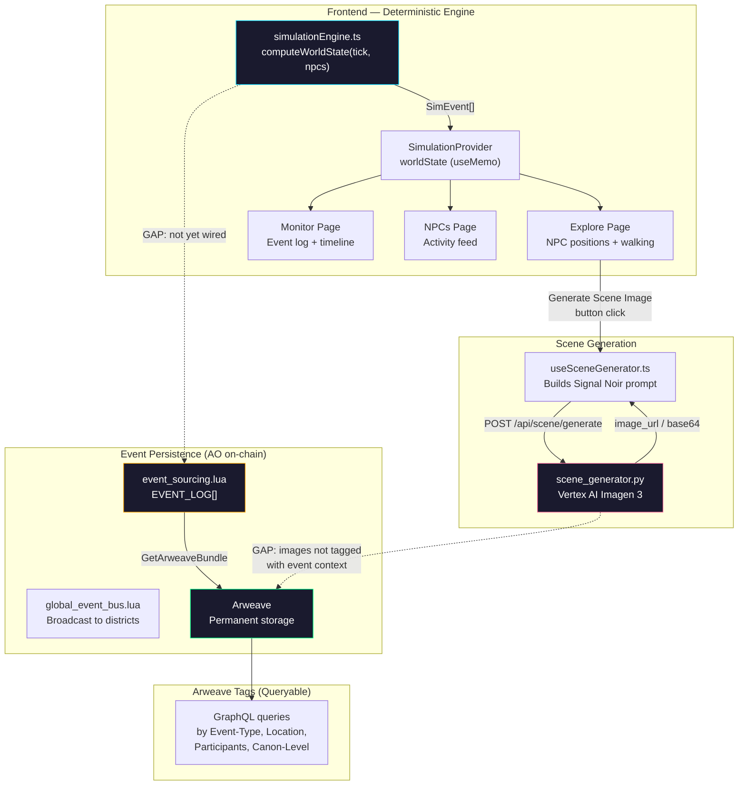

# Event Persistence & Scene Generation Architecture

> How simulation events flow through the system, get persisted, tagged, and eventually turned into visual content.

---

## System Overview



---

## 1. Event Persistence — Three Layers

### Layer 1: Frontend Deterministic Engine

| File | Purpose |
|------|---------|
| [`simulationEngine.ts`](file:///Users/ram/Documents/wandern/ao-world-engine-studio/src/lib/simulationEngine.ts) | Computes NPC positions + events for any tick |
| [`SimulationProvider.tsx`](file:///Users/ram/Documents/wandern/ao-world-engine-studio/src/components/SimulationProvider.tsx) | Shares `worldState` across all pages via React context |

**How it works:** Given a tick number and NPC list, the engine deterministically produces the same events and positions every time (FNV-1a hash, no `Math.random()`). 

**Key function:** `computeWorldState(tick, npcs) → WorldState`

```typescript
WorldState {
    tick: number;
    hour: number;
    period: string;          // "morning" | "afternoon" | "evening" | "night"
    timeString: string;      // "14:30"
    positions: Map<string, NPCPosition>;  // Where each NPC is
    events: SimEvent[];      // What happened this tick
}
```

**Event fields available for tagging:**

| Field | Example | Tag Potential |
|-------|---------|---------------|
| `type` | `bar_fight` | `Event-Type` tag |
| `locationId` | `B006` | `Location` tag |
| `locationName` | `The Rusty Anchor Bar` | `Location-Name` tag |
| `district` | `Undercity` | `District` tag |
| `involvedNpcIds` | `["npc_0042", "npc_0108"]` | `Participants` tag |
| `severity` | `major` | `Severity` / `Canon-Level` tag |
| `tick` | `500` | `Tick` tag |
| `time` | `14:30` | `Time` tag |

> [!IMPORTANT]
> **Determinism = Free Replay.** Since the engine is deterministic, you can always recompute any tick's state without storage: `computeWorldState(500, npcs)` gives the exact same result every time. Storage is needed for *searchability*, not for *reconstruction*.

---

### Layer 2: AO Process Event Sourcing (On-Chain)

| File | Purpose |
|------|---------|
| [`event_sourcing.lua`](file:///Users/ram/Documents/wandern/ao-world-engine/ao-processes/event_sourcing.lua) | Full event log with query capabilities |
| [`global_event_bus.lua`](file:///Users/ram/Documents/wandern/ao-world-engine/ao-processes/global_event_bus.lua) | Broadcasts events to district processes |

**Built-in AO Handlers:**

| Handler | Action Tag | What It Does |
|---------|------------|-------------|
| `LogEvent` | `Action: "LogEvent"` | Writes to `EVENT_LOG[]` with type, actor, payload, tick |
| `GetRecentEvents` | `Action: "GetRecentEvents"` | Returns last N events |
| `GetActorEvents` | `Action: "GetActorEvents"` | Query by NPC ID |
| `GetArweaveBundle` | `Action: "GetArweaveBundle"` | Export for Arweave persistence |
| `CreateSnapshot` | `Action: "CreateSnapshot"` | State checkpoint for replay |

**Built-in Query Functions:**

```lua
get_events_by_type("bar_fight", 50)     -- All bar fights, last 50
get_events_by_actor("npc_0042", 100)    -- Everything Zero Chen did
get_events_in_range(400, 500)           -- All events ticks 400-500
get_recent_events(20)                   -- Last 20 events
get_events_up_to_tick(500)              -- Time-travel: replay to tick 500
```

**Event Types Already Defined:**

```lua
EVENT_TYPES = {
    NPC_MOVED        = "npc_moved",
    NPC_ACTION       = "npc_action",
    NPC_INTERACTION  = "npc_interaction",
    NPC_MOOD_CHANGED = "npc_mood_changed",
    TRANSACTION      = "transaction",
    BUILDING_ACTIVITY= "building_activity",
    DISTRICT_UPDATE  = "district_update",
    -- ... more
}
```

---

### Layer 3: Arweave Permanent Tags (GraphQL Searchable)

Defined in [`world_codec_13_canon_events.json`](file:///Users/ram/Documents/wandern/ao-world-engine/data/codec_chunks/world_codec_13_canon_events.json).

**Required Tags for Permanent Events:**

| Tag Name | Value Example | Purpose |
|----------|--------------|---------|
| `App-Name` | `AO-World-Engine` | App identifier |
| `Type` | `canon_event` | Data type |
| `Event-Type` | `EVT_FIGHT` | What happened |
| `Location` | `L011` | Where it happened |
| `Participants` | `zero_chen,charlie` | Who was involved |
| `Canon-Level` | `core` / `major` / `minor` | Importance |
| `Signed-By` | `WALLET_ADDRESS` | Authority |

**Anyone can query via GraphQL:**

```graphql
# Find all bar fights
{
  transactions(tags: [
    { name: "App-Name", values: ["AO-World-Engine"] },
    { name: "Event-Type", values: ["EVT_FIGHT"] }
  ]) {
    edges { node { id tags { name value } } }
  }
}

# Find all events at a specific location
{
  transactions(tags: [
    { name: "App-Name", values: ["AO-World-Engine"] },
    { name: "Location", values: ["L011"] }
  ]) {
    edges { node { id } }
  }
}

# Find everything involving a specific NPC
{
  transactions(tags: [
    { name: "App-Name", values: ["AO-World-Engine"] },
    { name: "Participants", values: ["zero_chen"] }
  ]) {
    edges { node { id } }
  }
}
```

---

### The Gap: What's Not Connected

```
Frontend SimEvent → ??? → AO EVENT_LOG → ??? → Arweave Tags
```

The frontend generates events deterministically but **never pushes them to AO or Arweave**. Three options to close this gap:

| Approach | Pros | Cons |
|----------|------|------|
| **Option A: Pure Deterministic** | Zero storage cost, replay any tick | Requires code to query, no search UI |
| **Option B: Push All to AO** | Searchable via AO handlers | High volume (~5-10 events/tick × 240 ticks/day) |
| **Option C: Hybrid — Major Only** | Best of both worlds, low volume | Some minor events not persisted |

**Recommended: Option C (Hybrid)**
- Minor events: recompute from deterministic engine on demand
- Major/canon events: push to `event_sourcing.lua` with full tags
- Canon events (story-critical): also upload to Arweave permanently

---

## 2. Scene Generation — Explore → Gemini Images

### Pipeline Overview

```
User clicks "Generate Scene Image" on Explore map
    ↓
useSceneGenerator.ts builds a Signal Noir prompt
    ↓ POST /api/scene/generate
scene_generator.py calls Vertex AI Imagen 3
    ↓ image_url or base64
Scene displayed in Explore sidebar
```

### Frontend: `useSceneGenerator.ts`

[View source](file:///Users/ram/Documents/wandern/ao-world-engine-studio/src/hooks/useSceneGenerator.ts)

**Input — What the scene generator receives:**

```typescript
NpcSceneInput {
    npcId: string;         // "npc_0042"
    npcName: string;       // "Zero Chen"
    archetype?: string;    // "fixer"
    faction?: string;      // "Neon Syndicate"
    mood: string;          // "cautious"
    activity: string;      // "drinking"
    buildingId: string;    // "B006"
    buildingName: string;  // "The Rusty Anchor Bar"
    buildingType: string;  // "commercial"
    districtName?: string; // "Undercity"
    hour: number;          // 21
    tick: number;          // 500
}
```

**Prompt Construction Pipeline:**

```
NPC identity → Building schematics → Time-of-day lighting → Activity pose → Signal Noir style
```

1. **Building Schematics** (from codec 16):
   - `commercial` → "neon-lit storefront with holographic displays"
   - `residential` → "brutalist concrete hab-block with narrow windows"
   - `temple` → "imposing cathedral-like structure with surveillance spires"
   - `industrial` → "rusted metal warehouse with exposed pipes"

2. **Time-of-Day Lighting** (from codec 18):
   - 6-9 AM → "dawn light filtering through smog, golden-grey haze"
   - 20-23 PM → "deep night, neon-drenched streets, rain-slicked reflections, cyberpunk noir"

3. **Activity Pose Mapping:**
   - `drinking` → "leaning against a bar counter, glass in hand"
   - `hacking` → "fingers flying over a holographic keyboard"
   - `patrolling` → "standing alert, scanning the surroundings"

4. **Style Enforcement:**
   - "Signal Noir cyberpunk aesthetic"
   - "cinematic composition, shallow depth of field"
   - "muted color palette with cyan and amber neon accents"

**Example Generated Prompt:**
```
Zero Chen, a fixer, affiliated with Neon Syndicate,
leaning against a bar counter, glass in hand,
standing in front of "The Rusty Anchor Bar",
a neon-lit storefront with holographic displays,
with glass doors, digital price tags, market stalls with glowing signs,
in the Undercity,
bustling, crowded, commercially vibrant,
deep night, neon-drenched streets, rain-slicked reflections, cyberpunk noir,
Signal Noir cyberpunk aesthetic,
cinematic composition, shallow depth of field,
muted color palette with cyan and amber neon accents,
atmospheric volumetric lighting,
guarded expression, eyes darting
```

### Fallback Chain

The hook tries three endpoints in order:

| Priority | Endpoint | Returns |
|----------|----------|---------|
| 1. | `POST /api/scene/generate` | Full image (URL or base64) + description |
| 2. | `POST /api/scene/describe` | Text description only |
| 3. | *(local fallback)* | The prompt string as description |

### Backend: `scene_generator.py`

[View source](file:///Users/ram/Documents/wandern/ao-world-engine/api/studioram/scene_generator.py)

Uses **Vertex AI Imagen 3** (`imagen-3.0-generate-001`) with the world plugin style system.

**Two generation modes:**

| Mode | Method | Output |
|------|--------|--------|
| Portrait | `generate_portrait(npc)` | 3:4 character portrait |
| Scene | `generate_scene(npcs, location, action)` | Wide cinematic scene |

**Style comes from the World Plugin system:**
```python
loader = WorldLoader('config.json')
loader.set_active_world("signal-noir")
style = loader.active_world.get_style()
# → genre, mood, lighting, color_palette
```

### Connection to Shared Simulation Engine

Now that the Explore page uses deterministic positions from `simulationEngine.ts`, the scene generator automatically gets **correct, synchronized data**:

```
Tick 500 → worldState.positions["npc_0042"] = { location: "B006", activity: "drinking" }
    ↓
User clicks "Generate Scene Image" for Zero Chen
    ↓
useSceneGenerator receives: { npcId: "npc_0042", activity: "drinking", buildingId: "B006", ... }
    ↓
Prompt includes the SAME building and activity that Monitor shows in its event log
```

> [!TIP]
> **Scene images could also be tagged and persisted.** When a scene image is generated, it contains the tick, building, NPC, and activity context. This metadata could be uploaded to Arweave with tags like `Type: scene_image`, `Tick: 500`, `Location: B006`, `NPC: zero_chen`, making visual content queryable alongside events.

---

## 3. Keyword / Tag Reference

These are the tags and keywords available for searching logs and events:

### Event Keywords (for log search)

| Keyword | Source | Example Query |
|---------|--------|--------------|
| `bar_fight` | SimEvent.type | Find all bar fights |
| `trade_deal` | SimEvent.type | Find all trades |
| `crime_report` | SimEvent.type | Find all crimes |
| `street_performance` | SimEvent.type | Find performances |
| NPC name | SimEvent.involvedNpcNames | Find Zero Chen events |
| Building ID | SimEvent.locationId | Find events at B006 |
| District | SimEvent.district | Find Undercity events |
| Severity | SimEvent.severity | `major` / `minor` |
| Tick range | SimEvent.tick | Events between T400-T500 |

### Arweave Tags (for permanent on-chain search)

| Tag | Values | GraphQL Searchable |
|-----|--------|-------------------|
| `App-Name` | `AO-World-Engine` | ✅ |
| `Type` | `canon_event`, `scene_image`, `snapshot` | ✅ |
| `Event-Type` | `EVT_FIGHT`, `EVT_MEET`, `EVT_TRADE`, etc. | ✅ |
| `Location` | `L001`–`L015`, `B001`–`B020` | ✅ |
| `Participants` | `zero_chen,charlie,kai_vance` | ✅ |
| `Canon-Level` | `core`, `major`, `minor`, `supplemental` | ✅ |
| `Tick` | `500` | ✅ |
| `District` | `undercity`, `market_district`, `temple_district` | ✅ |

### AO Handler Queries (for live on-chain search)

| Query | AO Action | Tag |
|-------|-----------|-----|
| "What did NPC X do?" | `GetActorEvents` | `ActorId: "npc_0042"` |
| "Last 50 events" | `GetRecentEvents` | `Count: "50"` |
| "Export for Arweave" | `GetArweaveBundle` | `IncludeFull: "true"` |
| "Event stats" | `GetEventStats` | *(none)* |

---

## 4. Future: Closing the Gaps

### Gap 1: Push Events to AO
Wire `SimulationProvider` to call `LogEvent` on the AO process when major events fire:

```typescript
// In SimulationProvider, when worldState changes:
if (worldState?.events.length > 0) {
    for (const evt of worldState.events) {
        if (evt.severity === 'major') {
            aoClient.sendMessage('LogEvent', {
                event_type: evt.type,
                payload: { ...evt },
                actor_id: evt.involvedNpcIds[0],
            });
        }
    }
}
```

### Gap 2: Tag Scene Images
When `useSceneGenerator` gets a successful image back, upload to Arweave with event tags:

```typescript
// After scene generation succeeds:
arweaveUpload(imageData, {
    'App-Name': 'AO-World-Engine',
    'Type': 'scene_image',
    'Tick': String(input.tick),
    'Location': input.buildingId,
    'NPC': input.npcId,
    'Activity': input.activity,
    'District': input.districtName,
});
```

### Gap 3: Video Generation
The animation pipeline (`/Users/ram/Documents/wandern/animation/`) uses Veo 3 for video generation. Scene images generated from the Explore page could serve as keyframes for video generation — the prompt context (NPC, location, activity, mood) is already in the correct Signal Noir format.
